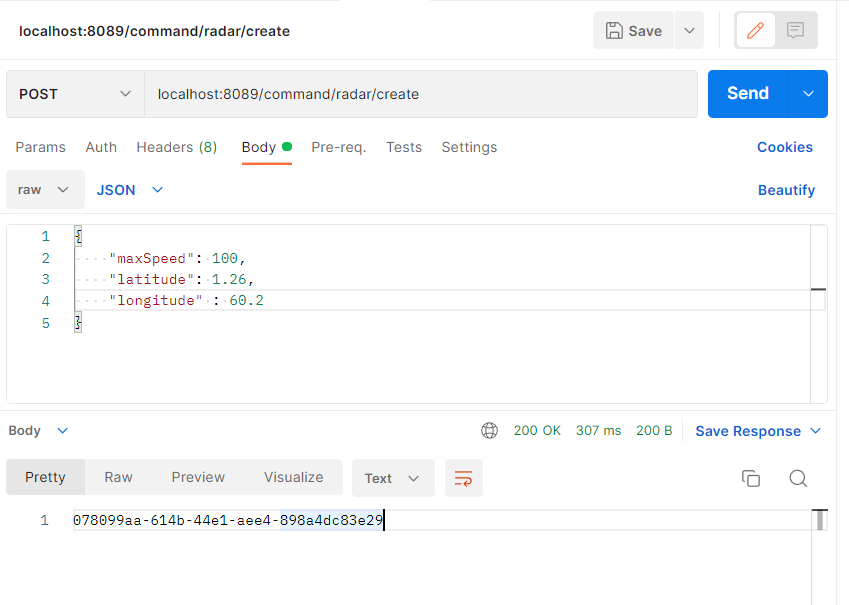
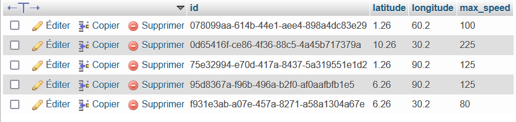

# cqrs event

## L'architecture du projet

## Le diagramme de classe global

## Service Radar 

### Tests 


### Commands
 * BaseCommand
```
package ma.enset.commands;

public abstract class BaseCommand<T> {
@TargetAggregateIdentifier
@Getter public T id;

    public BaseCommand(T id) {
        this.id = id;
    }

}
```

* CreateRadarCommand
```
package ma.enset.commands;

import lombok.Getter;

public class CreateRadarCommand extends BaseCommand<String> {
    @Getter public double maxSpeed;
    @Getter public double latitude;
    @Getter public double longitude;
    public CreateRadarCommand(String id, double maxSpeed, double latitude, double longitude) {
        super(id);
        this.maxSpeed = maxSpeed;
        this.latitude = latitude;
        this.longitude = longitude;
    }
}
```

### Controllers 

* RadarCommandController
```
package ma.enset.commands.controllers;

@RestController
@RequestMapping("/command/radar")
@AllArgsConstructor
@Service
public class RadarCommandController {
    private CommandGateway commandGateway;

    @PostMapping(path = "/create")
    public CompletableFuture<String> createRadar(@RequestBody CreateRadarRequestDTO createRadarRequestDTO) {
        CompletableFuture<String> response = commandGateway.send(new CreateRadarCommand(
                UUID.randomUUID().toString(),
                createRadarRequestDTO.getMaxSpeed(),
                createRadarRequestDTO.getLatitude(),
                createRadarRequestDTO.getLongitude()
        ));
        return response;
    }


    @ExceptionHandler(Exception.class)
    public ResponseEntity<String> handleException(Exception e) {
        return new ResponseEntity<String>(e.getMessage(), HttpStatus.INTERNAL_SERVER_ERROR);
    }
}
```

### Events
* BaseEvent
```
package ma.enset.events;

import lombok.Getter;

public abstract class BaseEvent<T> {
    @Getter public T id;

    public BaseEvent(T id) {
        this.id = id;
    }

}
```
* RadarCreatedEvent

```
package ma.enset.events;

import lombok.Getter;

public class RadarCreatedEvent extends BaseEvent<String> {
    @Getter private double maxSpeed;
    @Getter private double latitude;
    @Getter private double longitude;
    public RadarCreatedEvent(String id, double maxSpeed, double latitude, double longitude) {
        super(id);
        this.maxSpeed = maxSpeed;
        this.latitude = latitude;
        this.longitude = longitude;
    }
}
```

### Aggregates
 - Il contient le Command handler
```

@Aggregate
public class RadarAggregate {
    @AggregateIdentifier
    private String radarId;
    private double maxSpeed;
    private double latitude;
    private double longitude;

    public RadarAggregate() {
        //Required by Axon
    }

    @CommandHandler
    public RadarAggregate(CreateRadarCommand command){
        if (command.maxSpeed < 0) {
            throw new IllegalArgumentException("Max Speed cannot be negative");
        }
        AggregateLifecycle.apply(new RadarCreatedEvent(
                command.getId(),
                command.getMaxSpeed(),
                command.getLatitude(),
                command.getLongitude()));
    }

    @EventSourcingHandler //change the state of the aggregate
    public void on(RadarCreatedEvent event){
        this.radarId = event.getId();
        this.maxSpeed = event.getMaxSpeed();
        this.latitude = event.getLatitude();
        this.longitude = event.getLongitude();
    }
}
```

### Query 
    